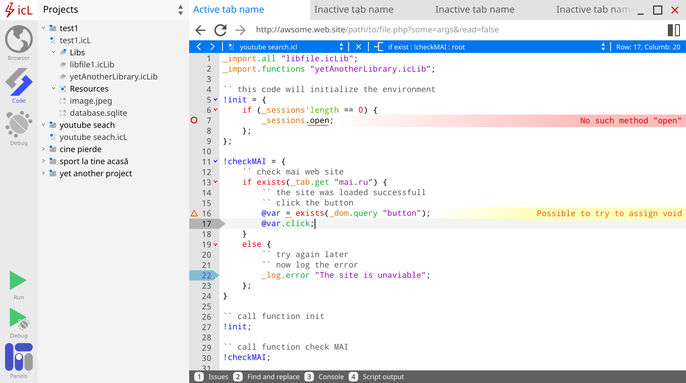
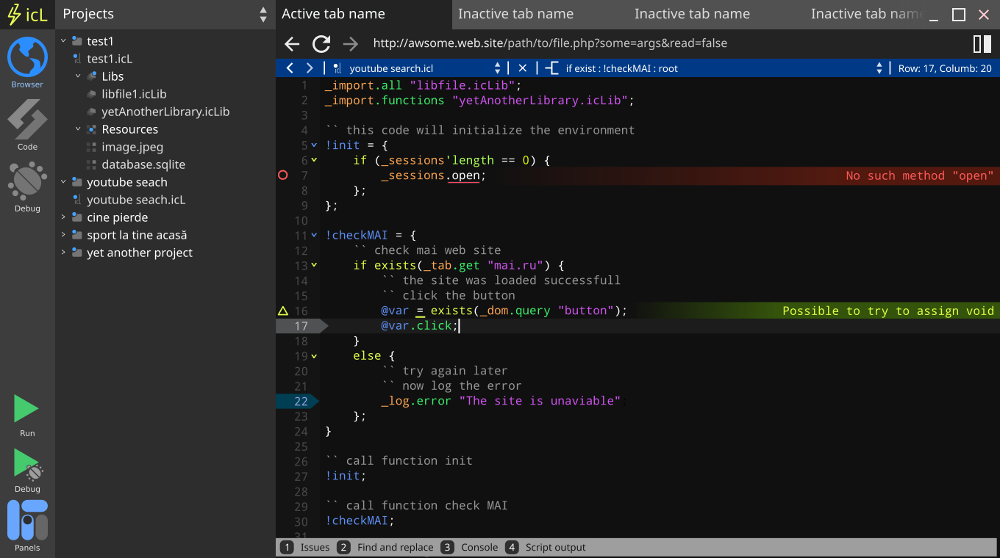
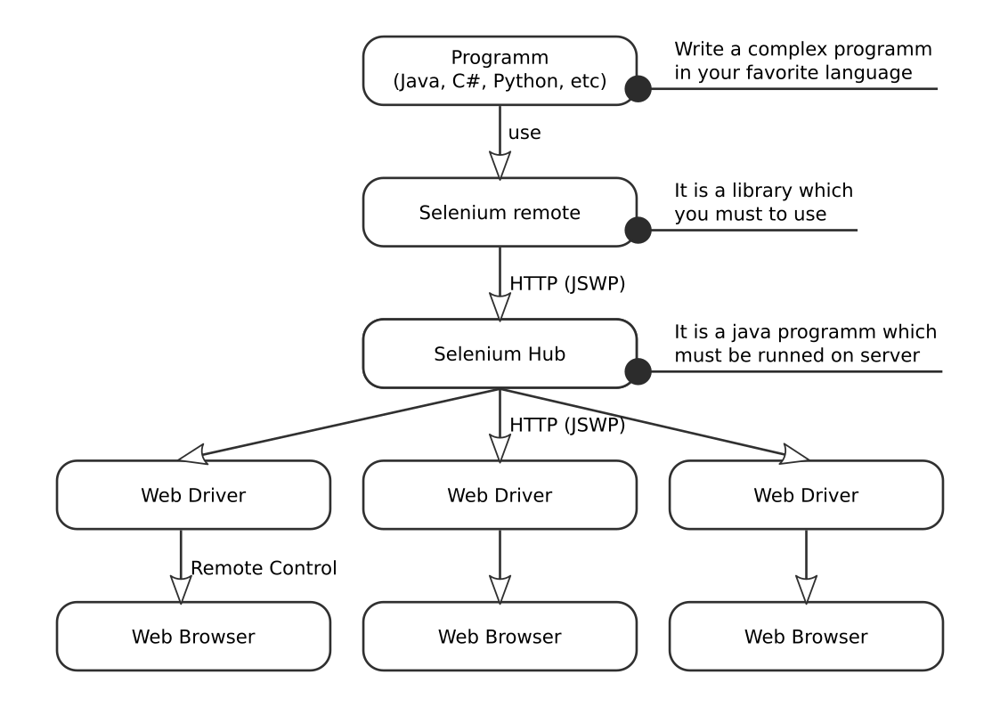
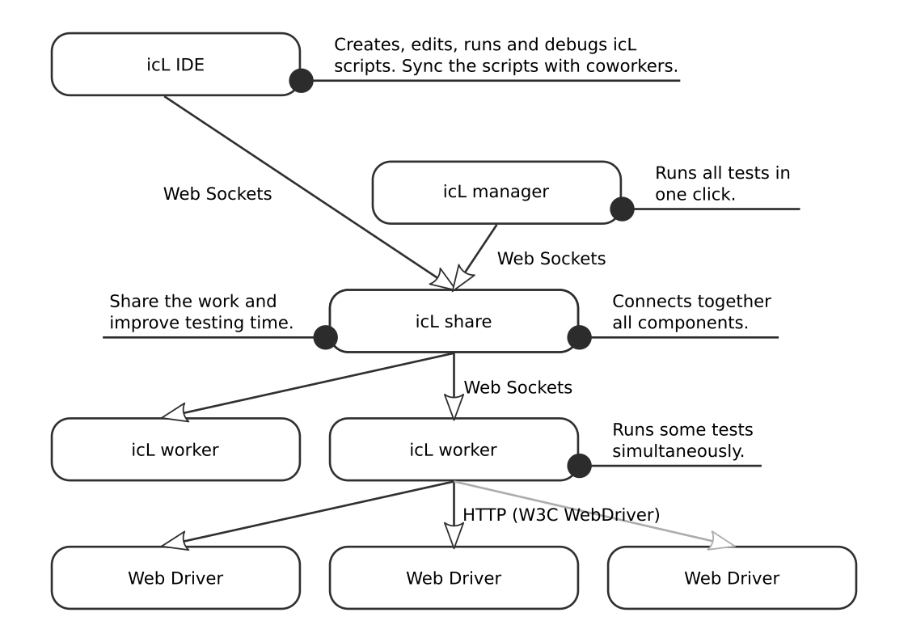

# Wellcome to icL

icL is a modern and powerfull web driver. If you want to participate in your
project please read the standard for language icL. Now the standard is in 
developement. Please wait for details. 

The documentation of icL code can be found 
[here](https://web.testing.gitlab.io/icL-docs/docs/).

# Look

The application will have the next look -

Already will be avialble a dark theme

For more images see [here](layouts/).

# icL vs Selenium

icL is not an alternative for Selenium, but for a stack : Selenium + Selenium 
Grid + Ranorex Studio + Ranorex Selocity. 

For crossplatform testing Selenium use the next architecture -

icL use a more complex, but more peformant architecture -

Comparation between icL share and Selenium Grid -

|Criteria              |Selenium Grid| icL share |
|----------------------|-------------|-----------|
|multithreading        |manual       |automatic  |
|trafic                |commands     |code + data|
|browsers              |same         |same + icL |
|API                   |W3C + JSWP   |W3C only   |
|crossplatform         |yes          |yes        |
|autoshare             |no           |yes        |
|optimization          |no           |yes        |
|extern IDE needed     |yes          |no         |
|safe password storange|no           |yes        |

# Contributing

Please read [CONTRIBUTING.md](CONTRIBUTING.md)